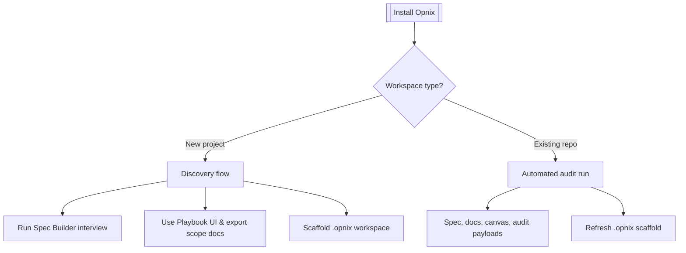

# Installation Decision Tree

Opnix now ships with an installation wizard that branches setup into two flows:

1. **New Project Discovery** – guides greenfield repositories through the interview blueprint and playbook export so scope is captured before code exists.
2. **Existing Repository Audit** – runs the full `claude$ setup` audit, generates specs/docs/canvas artefacts, and surfaces follow-up actions.

Kick off the neon installer with:

```
npm run setup:install
```

The installer verifies dependencies, prepares directories, and then launches the decision tree. To run only the decision flow:

```
npm run setup:wizard
```

If stdin is interactive, the wizard shows a summary of detected modules/tickets/dependencies and asks you to choose a path. In CI or non-interactive shells, it auto-selects the best match based on repository telemetry.



## New Project Flow
- Generates `spec/revision/opnix-new-project-scope-*.md` outlining the staged interview, section highlights, and next steps.
- Directs operators to the Spec Builder, Playbook UI, and `docs/interview-playbook.md` for discovery.
- Writes `.opnix/scaffold/` with module dossiers, ticket stubs, tech-stack baseline, and starter framework code without overwriting prior runs.
- Designed for workspaces without modules, tickets, or dependencies yet—ideal right after repo creation.

## Existing Repository Flow
- Invokes the same audit pipeline exposed via `claude$ setup` to produce spec kits, documentation, canvas snapshots, and audit JSON.
- Writes a summary handoff to `spec/audits/opnix-existing-project-entry-*.md` with key stats and top follow-ups.
- Refreshes `.opnix/scaffold/` so module health, ticket exports, and tech-stack manifests always reflect the latest audit.
- Ideal after dropping `data/tickets.json` or when scanning an established codebase.

The wizard remembers your last selection in `data/setup-state.json`, and you can review prior runs from the CLI history prompt. Re-run the wizard whenever the workspace changes (e.g., after initial discovery or post-remediation) to pivot between flows or refresh the spec archive.
