# Server Routing & Service Map

## Express Topology Overview
- `server.js` bootstraps middleware (CORS, JSON/urlencoded, gzip compression) and mounts all domain routers from `routes/`.
- Heavy orchestration (audits, exports, question workflows) lives inside the `services/` directory.
- Each router owns its domain logic and consumes shared services as needed.

### Routers
| Router | Responsibility |
| --- | --- |
| `routes/root.js` | CLI banner vs. SPA shell for `/` |
| `routes/static.js` | Public assets (`express.static`) with cache headers |
| `routes/tickets.js` | Ticket CRUD, search, bug workflows |
| `routes/modules.js` | Module detection, links, graph exports |
| `routes/features.js` | Feature CRUD + acceptance criteria hooks |
| `routes/checklists.js` | Operational checklist CRUD and status hooks |
| `routes/docs.js` | Markdown browse/read/save endpoints + `/api/docs/generate` export |
| `routes/exports.js` | Archive listings, markdown exports |
| `routes/diagrams.js` | Mermaid diagram generation & retrieval |
| `routes/specs.js` | Spec/API generation plus runbook interviews |
| `routes/cli.js` | CLI slash commands & terminal history |
| `routes/context.js` | UltraThink gating, context telemetry |
| `routes/progressive.js` | Progressive document system endpoints |
| `routes/storybook.js` | Storybook status/startup controls |
| `routes/canvas.js` | Canvas export & roadmap endpoints |

### Services
| Service | Purpose |
| --- | --- |
| `services/auditManager.js` | Aggregates spec/docs/canvas exports, diagrams, follow-up tickets; exposes `runInitialAudit`, `loadDiagramContext` |
| `services/moduleDetector.js` | Filesystem module detection + manual module merge |
| `services/specGenerator.js` | Specification export (JSON/Markdown/GitHub Spec Kit) |
| `services/docsGenerator.js` | Markdown report builder for audits |
| `services/diagramGenerator.js` | Mermaid diagram composers |
| `services/cliInterviewManager.js` | CLI interview session orchestration |
| `services/progressiveDocumentSystem.js` | Progressive doc pipeline |
| `services/runbookGenerator.js` | Runbook Markdown exports |
| `services/runtimeBundler.js` | Sync artefacts into the `.opnix` runtime bundle |
| `services/apiSpecGenerator.js` | API spec generation & validation |
| `services/artifactGenerator.js` | Story/diagram scaffolding utilities |
| `services/featureUtils.js` | Feature normalisation & status hooks |
| `services/checklistUtils.js` | Checklist normalisation & transitions |
| `services/ticketUtils.js` | Ticket status hooks and normalisers |
| `services/roadmapState.js` | Roadmap state persistence, sync, backups, rollback |
| `services/scaffolder.js` | Workspace scaffolding helpers |
| `services/bugWorkflowManager.js` | CLI bug workflow automation |
| `services/interviewLoader.js` | Interview blueprint/question loader |
| `services/progressiveQuestionEngine.js` | Adaptive question branching engine |

## Mermaid Architecture Diagram

```mermaid
graph TD
    A[server.js] --> M{Middleware}
    M -->|CORS/JSON/Gzip| B1[compression]
    M -->|Root Shell| R1[root.js]
    M -->|Static Assets| R2[static.js]

    A --> R3[tickets.js]
    A --> R4[modules.js]
    A --> R5[features.js]
    A --> R6[checklists.js]
    A --> R7[docs.js]
    A --> R8[exports.js]
    A --> R9[diagrams.js]
    A --> R10[specs.js]
    A --> R11[cli.js]
    A --> R12[context.js]
    A --> R13[progressive.js]
    A --> R14[storybook.js]
    A --> R15[canvas.js]

    subgraph Services
        S1[moduleDetector.js]
        S2[specGenerator.js]
        S3[docsGenerator.js]
        S4[diagramGenerator.js]
        S5[auditManager.js]
        S6[cliInterviewManager.js]
        S7[progressiveDocumentSystem.js]
        S8[runbookGenerator.js]
        S9[runtimeBundler.js]
        S10[ticketUtils.js]
        S11[featureUtils.js]
        S12[checklistUtils.js]
        S13[artifactGenerator.js]
        S14[progressiveQuestionEngine.js]
        S15[apiSpecGenerator.js]
        S16[bugWorkflowManager.js]
        S17[scaffolder.js]
        S18[interviewLoader.js]
    end

    R3 --> S10
    R3 --> S5
    R4 --> S1
    R4 --> S5
    R5 --> S11
    R6 --> S12
    R7 --> S3
    R7 --> S5
    R8 --> S3
    R8 --> S9
    R9 --> S4
    R9 --> S5
    R10 --> S2
    R10 --> S5
    R10 --> S8
    R11 --> S6
    R11 --> S14
    R12 --> S6
    R13 --> S7
    R13 --> S4
    R14 --> S9
    R15 --> S1
    R15 --> S5

    S5 --> S1
    S5 --> S2
    S5 --> S3
    S5 --> S4
    S5 --> S8
    S5 --> S9
    S5 --> S10
    S5 --> S11
    S5 --> S12
    S5 --> S18
```

## Current Metrics
- `server.js` line count: **1,552 lines** (~51 KB). All route groups now live in router modules; orchestration sits inside the service layer.
- Phase 11 (`TODO.md`) marked complete with validation runs (`pnpm test:modules`, `pnpm build`).

_Last updated: 2025-09-27_
