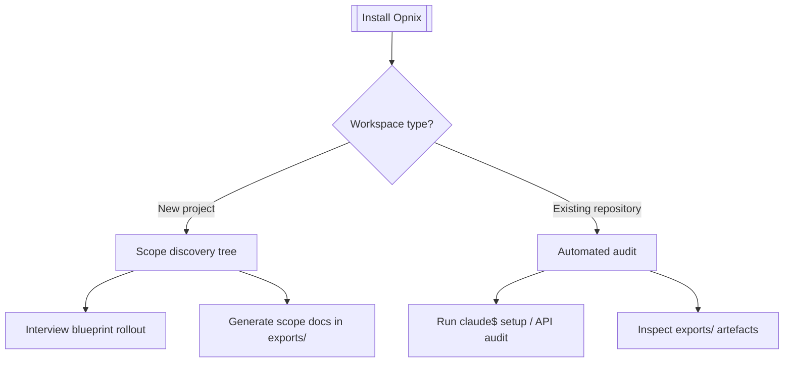

# OTKit Installation Decision Tree — Existing Repository Path

## Decision Tree

## Automated Audit Summary
- Modules detected: 7
- Internal dependencies: 3
- Open tickets: 1
- High-priority tickets: 1

## Recommended Follow-Ups
- Improve health of Backend API (currently 47%)
- Increase automated test coverage for Backend API (currently 0%)
- Backend API contains 5 TODO/FIXME markers that need attention
- Increase automated test coverage for Agent Library (currently 0%)
- Increase automated test coverage for Documentation (currently 0%)

## Generated Artefacts
- opnix-spec-2025-09-24T20-32-05-188Z.json
- opnix-spec-2025-09-24T20-32-05-188Z.spec.md
- opnix-docs-2025-09-24T20-32-05-189Z.md
- opnix-canvas-audit-2025-09-24T20-32-05-189Z.json
- opnix-audit-2025-09-24T20-32-05-189Z.json

All artefacts are stored in `exports/`. Re-run `claude$ setup` after addressing follow-ups to refresh the audit.
